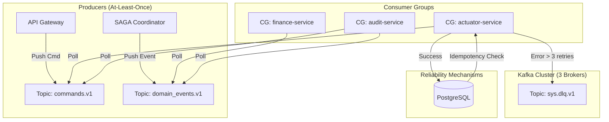

# RFC-PHOENIX-02: Sistema de Mensajería Resiliente y Persistente

| Metadatos | Detalle |
| :--- | :--- |
| **Proyecto** | LeadBoostAI - Re-Plataforma Enterprise |
| **Fase** | FASE 2 - Resiliencia de Mensajería |
| **Autor** | Principal Systems Architect |
| **Estado** | `DRAFT` (Pendiente de Aprobación del Comité Técnico) |
| **Dependencias** | RFC-PHOENIX-01 (Fase 1: Persistencia) |
| **Tecnología Core** | Apache Kafka |

-----

## 1\. Resumen Ejecutivo y Justificación

### 1.1 El Problema (Estado Actual)

La arquitectura actual basada en `Redis Pub/Sub` opera bajo un modelo "fire-and-forget". Si un microservicio (ej. Actuador) se reinicia, colapsa o sufre latencia de red durante la emisión de un evento crítico (ej. `BUDGET_APPROVED`), ese mensaje se evapora. Esto viola los principios de integridad financiera y consistencia eventual requeridos para un sistema que gestiona capital de clientes.

### 1.2 La Solución (Target Architecture)

Implementación de un **Log Distribuido Persistente (Kafka)**. Esto desacopla la producción del consumo no solo en espacio (como Pub/Sub), sino en **tiempo**.

  * **Garantía:** Los mensajes persisten en disco (Commit Log) hasta que son procesados y confirmados explícitamente.
  * **Capacidad:** Replay histórico para corrección de errores, auditoría forense y reentrenamiento de modelos ML.

-----

## 2\. Arquitectura del Sistema de Mensajería

### 2.1 Diagrama de Flujo de Datos (Mermaid)



### 2.2 Topología de Tópicos y Particionamiento

Se define una estrategia de tópicos estricta para garantizar orden y segregación.

| Tópico | Propósito | Partition Key (Obligatorio) | Semántica de Orden | Retención |
| :--- | :--- | :--- | :--- | :--- |
| `core.commands.v1` | Órdenes imperativas (ej: `execute_campaign`) | `tenant_id` | Serialización por Cliente | 7 Días |
| `core.events.v1` | Hechos de dominio (ej: `campaign_created`) | `tenant_id` | Serialización por Cliente | 30 Días |
| `sys.deadletter.v1` | Mensajes fallidos tras reintentos | `original_partition` | N/A | 30 Días |
| `sys.audit.v1` | Trazas para el Event Store (Fase 1) | `trace_id` | N/A | 90 Días |

**Configuración de Infraestructura Kafka:**

  * **Replication Factor:** 3 (Tolerancia a fallo de hasta 2 nodos sin pérdida de datos).
  * **Min In-Sync Replicas (ISR):** 2 (Garantía de durabilidad fuerte).
  * **Particiones:** Base 12 (Escalable horizontalmente hasta 12 instancias consumidoras por grupo).
  * **Compresión:** Snappy o LZ4 (Optimización de throughput).

-----

## 3\. Semántica de Entrega y Fiabilidad

### 3.1 Semántica: At-Least-Once (Al menos una vez)

El sistema **garantiza** que ningún mensaje se pierde, pero **admite** que, en casos de fallo de red justo después del procesamiento pero antes del ACK, un mensaje pueda entregarse dos veces.

  * **Producer:** `acks=all` (Espera confirmación de todos los ISR).
  * **Consumer:** `enable.auto.commit=false`. El commit del offset se realiza **manualmente** solo después de que la transacción en PostgreSQL (Fase 1) ha sido exitosa.

### 3.2 Idempotencia (El Escudo contra Duplicados)

Dado que usamos *At-Least-Once*, la idempotencia es obligatoria en el consumidor. Se utilizará la tabla `sys.request_keys` definida en la Fase 1.

**Algoritmo de Consumo Idempotente:**

1.  Leer mensaje de Kafka.
2.  Extraer `message_id` (o hash determinista del payload).
3.  **BEGIN TRANSACTION (Postgres)**
4.  Insertar/Verificar en `sys.request_keys` (`INSERT ON CONFLICT DO NOTHING`).
      * Si inserta: Procesar lógica de negocio.
      * Si conflicto (ya existe): Marcar como duplicado, no procesar lógica.
5.  **COMMIT TRANSACTION**
6.  `consumer.commitSync()` (Kafka).

-----

## 4\. Integración con SAGA Coordinator (Fase 1)

El orquestador de SAGA no llamará directamente a los microservicios vía HTTP. Publicará comandos en Kafka.

1.  **SAGA (Started):** Publica `CreateCampaign` en `core.commands.v1`.
2.  **Actuador:** Consume comando -\> Ejecuta -\> Publica `CampaignCreated` en `core.events.v1`.
3.  **SAGA (Waiting):** Consume `CampaignCreated` -\> Avanza estado a `NEXT_STEP`.

-----

## 5\. Estrategia de Resiliencia y Fallos

### 5.1 Manejo de Errores y Dead Letter Queue (DLQ)

Si un consumidor falla al procesar un mensaje (ej. bug de código, data corrupta):

1.  **Reintento en Memoria:** 3 intentos con backoff exponencial (1s, 2s, 5s).
2.  **Circuit Breaker:** Si el error es de conexión externa (ej. API de Meta caída), abrir circuito y pausar consumo de esa partición temporalmente.
3.  **Envío a DLQ:** Si falla tras reintentos locales, publicar mensaje original + stacktrace en `sys.deadletter.v1` y hacer commit en el tópico original para no bloquear la cola.

### 5.2 Casos de Fallo Soportados

| Escenario | Comportamiento del Sistema | Recuperación |
| :--- | :--- | :--- |
| **Caída de Consumidor** | Kafka detecta timeout de heartbeat. Rebalancea particiones a instancias vivas. | Automática (\< 10s). |
| **Mensaje Duplicado** | Detectado por `sys.request_keys` en BD. | Ignorado (Idempotencia). |
| **Caída de BD** | El consumidor no puede hacer commit. Se detiene el loop. | Reinicio de pod/servicio tras backoff. |
| **Mensaje Corrupto (Poison Pill)** | Falla validación de esquema (Avro/JSON). | Envío inmediato a DLQ. |
| **Pico de Tráfico** | Lag de consumo aumenta. Mensajes se encolan en disco. | Auto-scaling de consumidores (HPA). |

### 5.3 Circuit Breakers & Rate Limits

Utilizaremos **Redis** (no persistente) para rate limiting distribuido (Token Bucket) antes de publicar mensajes, protegiendo a los consumidores de inundaciones.

  * **Límite:** X mensajes/segundo por Tenant.
  * **Acción:** Si excede, API Gateway retorna 429, no se encola el mensaje.

-----

## 6\. DDL de Soporte en PostgreSQL (Esquema `sys`)

Se requieren tablas adicionales para soportar la trazabilidad forense de la mensajería y el control de replay, extendiendo el esquema de la Fase 1.

```sql
-- Tabla para control granular de offsets por consumidor (para replays controlados)
CREATE TABLE sys.consumer_offsets_log (
    consumer_group VARCHAR(100) NOT NULL,
    topic VARCHAR(100) NOT NULL,
    partition INT NOT NULL,
    committed_offset BIGINT NOT NULL,
    last_updated TIMESTAMPTZ DEFAULT NOW(),
    PRIMARY KEY (consumer_group, topic, partition)
);

-- Tabla extendida de idempotencia para mensajería (Complementa sys.request_keys de Fase 1)
-- Permite rastrear qué mensaje de Kafka originó qué transacción
CREATE TABLE sys.message_traceability (
    kafka_message_id VARCHAR(255) PRIMARY KEY, -- Header 'Message-ID'
    topic VARCHAR(100) NOT NULL,
    partition INT NOT NULL,
    "offset" BIGINT NOT NULL,
    consumer_group VARCHAR(100) NOT NULL,
    status VARCHAR(20) CHECK (status IN ('PROCESSED', 'DUPLICATE', 'DLQ', 'SKIPPED')),
    processed_at TIMESTAMPTZ DEFAULT NOW(),
    saga_correlation_id UUID -- Link opcional a la tabla sys.sagas
);

-- Tabla para Dead Letter Queue (Revisión humana o replay manual)
CREATE TABLE sys.dead_letters (
    id UUID PRIMARY KEY DEFAULT uuid_generate_v4(),
    original_topic VARCHAR(100) NOT NULL,
    original_partition INT NOT NULL,
    original_offset BIGINT NOT NULL,
    consumer_group VARCHAR(100) NOT NULL,
    exception_class VARCHAR(200),
    exception_message TEXT,
    payload JSONB NOT NULL,
    headers JSONB,
    created_at TIMESTAMPTZ DEFAULT NOW(),
    replay_status VARCHAR(20) DEFAULT 'PENDING' CHECK (replay_status IN ('PENDING', 'REPLAYED', 'ARCHIVED'))
);
```

-----

## 7\. Requisitos de Seguridad

1.  **Transporte:** mTLS (Mutual TLS) obligatorio entre microservicios y brokers Kafka. Puerto 9093.
2.  **Autenticación:** Certificados X.509 firmados por CA interna (o SASL/SCRAM si la gestión de certificados es compleja).
3.  **Autorización (ACLs):**
      * `AnalystService`: Read/Write en `events.*`, Read en `commands.*`.
      * `ActuatorService`: Read en `commands.*`, Write en `events.*`.
      * `AuditService`: Read-Only en `*`.

-----

## 8\. Definición de SLOs (Service Level Objectives)

  * **Disponibilidad de Ingesta:** 99.95% (El broker acepta el mensaje).
  * **Latencia de Entrega (End-to-End):**
      * p50: \< 50ms
      * p99: \< 200ms
  * **Integridad de Datos:** 100% (Cero pérdida de mensajes confirmados).

-----

## 9\. Checklist de Aceptación para Auditores

Para dar por cerrada la Fase 2, el ingeniero de SRE debe validar:

  - [ ] **Prueba de "Cable Cortado":** Desconectar un consumidor abruptamente mientras procesa. Al reconectar, debe retomar el mismo mensaje (no ACKed) y procesarlo exitosamente sin duplicar efectos secundarios (validado via `sys.request_keys`).
  - [ ] **Prueba de "Veneno":** Inyectar un JSON malformado. Debe aparecer en `sys.dead_letters` y el consumidor debe seguir procesando el siguiente mensaje.
  - [ ] **Prueba de Escalado:** Añadir un nuevo consumidor al grupo. Kafka debe rebalancear particiones automáticamente.
  - [ ] **Prueba de Persistencia:** Reiniciar todo el cluster de Kafka. Los mensajes no consumidos deben persistir en disco.
  - [ ] **Validación de ACLs:** Un servicio no autorizado debe recibir rechazo al intentar leer un tópico restringido.
  - [ ] **Observabilidad:** Métricas de *Consumer Lag* visibles en Dashboard (Grafana/Datadog).

-----

**FIN DEL RFC-PHOENIX-02**