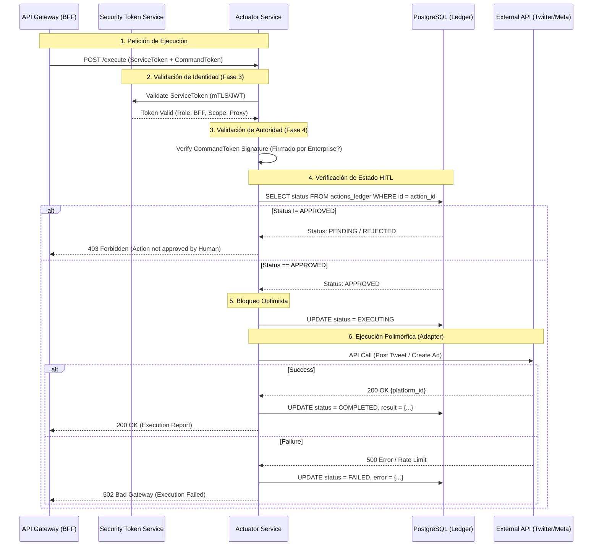

# 📄 RFC-PHOENIX-04: ACTUATOR & ORCHESTRATION ENGINE

| Metadatos | Detalle |
| :--- | :--- |
| **Proyecto** | LeadBoostAI - Sistema Operativo Empresarial Autónomo |
| **Fase** | FASE 4 - Actuator & Orchestration Engine |
| **Autor** | Principal Systems Architect |
| **Estado** | `DRAFT` (Pendiente de Aprobación de Ingeniería) |
| **Dependencias** | RFC-PHOENIX-03 (IAM/STS), DMC v1.0 (Cap. Ejecución) |
| **Arquitectura** | Hexagonal (Ports & Adapters) |

-----

## 1\. Resumen Ejecutivo

### 1.1 El Problema

Hasta ahora, la ejecución de acciones (publicar tweets, lanzar campañas) estaba acoplada a la lógica de decisión o simulada. Esto viola el **Principio de Invariante \#5 del DMC**: *"El Actuator no piensa, solo ejecuta"*. Además, carecemos de un mecanismo de aislamiento que permita cambiar proveedores (ej. de Meta a TikTok) sin reescribir el núcleo del sistema.

### 1.2 La Solución (Target Architecture)

Implementaremos el **Motor de Actuación (Microservice Actuator)** bajo una **Arquitectura Hexagonal**. Este servicio será un "brazo mecánico" tonto pero extremadamente robusto.

  * **Desacoplamiento:** El Core no conoce las APIs externas; usa interfaces (`Ports`). Los `Adapters` (Handlers) implementan la lógica sucia de cada proveedor.
  * **Seguridad de Ejecución:** Implementación de un pipeline de validación criptográfica (`command_token`) y de estado (`HITL`) antes de cualquier llamada externa.

-----

## 2\. Arquitectura del Sistema

### 2.1 Patrón Hexagonal (Ports & Adapters)

El servicio se dividirá estrictamente en tres capas concéntricas:

1.  **Dominio (Core):** Define *qué* se puede hacer (`IPlatformAdapter`, `ExecutionCommand`, `ExecutionResult`). No tiene dependencias externas.
2.  **Puertos (Ports):** Interfaces que definen cómo el mundo exterior habla con el Core (API REST) y cómo el Core habla con el exterior (Interfaces de Adaptadores).
3.  **Adaptadores (Infrastructure):** Implementaciones concretas.
      * *Driving Adapters (Entrada):* FastAPI Router (`POST /execute`).
      * *Driven Adapters (Salida):* `TwitterHandler`, `MetaHandler`, `PostgresRepository`.

### 2.2 Diagrama de Secuencia: El Pipeline de Ejecución Seguro

Este flujo garantiza que ninguna acción ocurra sin autorización explícita de `Enterprise` (Fase 3) y validación humana (HITL).



-----

## 3\. Especificación Técnica de Componentes

### 3.1 Estructura del Proyecto (`microservice_actuator/`)

```text
microservice_actuator/
├── core/
│   ├── __init__.py
│   ├── domain_models.py       # Pydantic Schemas (Input/Output neutros)
│   ├── interfaces.py          # Clases Abstractas (Ports)
│   └── exceptions.py          # Excepciones de dominio (ej. PlatformError)
├── handlers/                  # Driven Adapters (Plugins)
│   ├── __init__.py
│   ├── factory.py             # Factory Pattern para instanciar handlers
│   ├── twitter_handler.py     # Implementación real
│   └── meta_handler.py        # Implementación real
├── routers/                   # Driving Adapters
│   ├── __init__.py
│   └── execution.py           # Endpoint FastAPI
├── services/
│   └── execution_service.py   # Lógica de orquestación (Glue code)
├── main.py                    # Entrypoint & DI Container
└── requirements.txt
```

### 3.2 Definición de Interfaces (`core/interfaces.py`)

El contrato que todos los plugins deben cumplir.

```python
from abc import ABC, abstractmethod
from typing import Dict, Any
from .domain_models import ExecutionResult, ActionPayload

class ISocialPlatformAdapter(ABC):
    """
    Puerto de salida (Driven Port).
    Define las capacidades genéricas requeridas por el Actuator.
    """

    @abstractmethod
    async def authenticate(self) -> bool:
        """Valida credenciales con el proveedor externo."""
        pass

    @abstractmethod
    async def post_content(self, payload: ActionPayload) -> ExecutionResult:
        """
        Ejecuta la publicación de contenido.
        Debe manejar sus propios reintentos y rate limits.
        """
        pass

    @abstractmethod
    async def get_metrics(self, resource_id: str) -> Dict[str, Any]:
        """Recupera métricas post-ejecución."""
        pass
```

### 3.3 Implementación de Handler (`handlers/twitter_handler.py`)

Ejemplo de cómo un adaptador encapsula la complejidad externa.

```python
import tweepy
from ..core.interfaces import ISocialPlatformAdapter
from ..core.domain_models import ExecutionResult, ActionPayload, ActionStatus

class TwitterHandler(ISocialPlatformAdapter):
    def __init__(self, api_key: str, api_secret: str, access_token: str, access_secret: str):
        self.client = tweepy.Client(
            consumer_key=api_key, consumer_secret=api_secret,
            access_token=access_token, access_token_secret=access_secret
        )

    async def post_content(self, payload: ActionPayload) -> ExecutionResult:
        try:
            # Lógica específica de Twitter
            response = self.client.create_tweet(text=payload.content_text)
            
            return ExecutionResult(
                action_id=payload.action_id,
                status=ActionStatus.COMPLETED,
                platform_ref_id=str(response.data['id']),
                metadata={"raw_response": response.data}
            )
        except tweepy.TooManyRequests:
            # Manejo específico de Rate Limit
            return ExecutionResult(
                action_id=payload.action_id,
                status=ActionStatus.RATE_LIMITED,
                error_message="Twitter API Rate Limit Exceeded"
            )
        except Exception as e:
            return ExecutionResult(
                action_id=payload.action_id,
                status=ActionStatus.FAILED,
                error_message=str(e)
            )
```

-----

## 4\. Contrato de API (OpenAPI Specification)

Endpoint expuesto por el microservicio para el BFF u otros orquestadores internos.

**Endpoint:** `POST /api/v1/actuator/execute`

**Headers:**

  * `Authorization`: `Bearer <Service_JWT_Token>` (Identidad de la máquina)
  * `X-Command-Signature`: `<HMAC_SHA256>` (Firma de Enterprise sobre el payload)

**Request Body (JSON Schema):**

```json
{
  "action_id": "uuid-v4",
  "platform": "TWITTER | META | LINKEDIN",
  "command_token": "jwt.signed.by.enterprise",
  "payload": {
    "content_text": "Texto del post o anuncio...",
    "media_urls": ["https://assets.leadboost.ai/img1.png"],
    "target_audience": {
      "age_range": [25, 45],
      "interests": ["AI", "Tech"]
    },
    "budget_bid": 15.50,
    "schedule_time": "2025-10-20T10:00:00Z"
  },
  "governance_hash": "sha256_of_approved_policy"
}
```

-----

## 5\. Integración con Base de Datos (HITL Ledger)

El actuador no tiene base de datos propia para reglas de negocio, pero debe tener acceso de **lectura/escritura** a la tabla de `execution_ledger` (definida en Fase 1) para validar el estado HITL.

**SQL Check (Pseudocódigo):**

```sql
SELECT status 
FROM governance.actions_ledger 
WHERE id = :action_id 
AND tenant_id = :tenant_id
AND status = 'APPROVED_BY_HUMAN'; -- Invariante crítico
```

-----

## 6\. Plan de Implementación (Paso a Paso)

1.  **Skeleton & Core:** Crear la estructura de carpetas y definir `domain_models.py` e `interfaces.py`. Sin lógica real.
2.  **Factory Pattern:** Implementar `handlers/factory.py` que devuelva la instancia correcta basada en el string `platform` ("TWITTER" -\> `TwitterHandler`).
3.  **Mock Adapters:** Crear `handlers/mock_handler.py` que simule latencia y respuestas exitosas para pruebas locales sin gastar cuota de API.
4.  **Database Integration:** Implementar la conexión a PostgreSQL para realizar el check de `APPROVED_BY_HUMAN`.
5.  **Security Layer:** Integrar el middleware de validación de tokens (STS Client) creado en Fase 3.
6.  **Twitter Implementation:** Implementar `TwitterHandler` real con credenciales inyectadas (vía Secret Manager).
7.  **API Router:** Conectar todo en `routers/execution.py` y exponerlo en `main.py`.

-----

## 7\. Criterios de Aceptación (DoD)

  * [ ] El servicio levanta en Docker y pasa el Health Check.
  * [ ] Si envío un `POST /execute` con un `action_id` que no está en estado `APPROVED` en la BD, recibo un 403.
  * [ ] Si envío un token inválido, recibo un 401.
  * [ ] Puedo ejecutar una acción en "Mock Mode" y ver el cambio de estado en la base de datos a `COMPLETED`.
  * [ ] El código del handler de Twitter no está mezclado con la lógica de validación HTTP (Separación de intereses).
  * [ ] Existe un diagrama de secuencia actualizado en la documentación del repositorio.

-----

**FIN DEL RFC-PHOENIX-04**