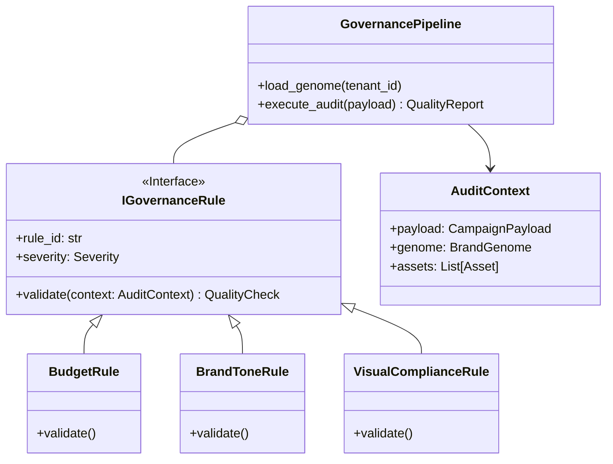

---

#📄 BLUEPRINT_FASE5_ENGINES.md: MOTOR DE GOBERNANZA & RIESGO| Metadatos | Detalle |
| --- | --- |
| **Proyecto** | LeadBoostAI - Phoenix V5 |
| **Fase** | **FASE 5.2 - COMPLIANCE & RISK ENGINES** |
| **Objetivo** | Implementar la lógica de "Adversario" que valida o rechaza campañas. |
| **Ubicación** | `microservice_optimizer/src/governance` (Refactorización) |
| **Patrón** | Chain of Responsibility / Strategy Pattern |
| **Estado** | `APPROVED FOR CONSTRUCTION` |

---

##1. Visión Arquitectónica: "El Juez de Hierro"El Sistema de Gobernanza no "sugiere". El Sistema de Gobernanza **juzga**.
Funciona bajo el principio de **Lista Blanca**: Todo está prohibido a menos que cumpla explícitamente con las reglas del **Genoma de Marca**.

###1.1 Diagrama de Clases (Motor de Reglas)Utilizaremos una arquitectura polimórfica donde cada regla es una unidad aislada y testeable.



---

##2. Estructura de Directorios PropuestaDentro del microservicio existente (o uno nuevo dedicado), crearemos una estructura modular:

```text
microservice_governance/
├── src/
│   ├── engine/
│   │   ├── __init__.py
│   │   ├── pipeline.py       # Orquestador del pipeline de reglas
│   │   ├── loader.py         # Carga del Brand Genome (JSON/DB)
│   │   └── context.py        # DTO con toda la data necesaria para auditar
│   ├── rules/                # REGLAS ATÓMICAS
│   │   ├── __init__.py
│   │   ├── base.py           # Clase abstracta IRule
│   │   ├── financial.py      # BudgetCapCheck, ROITargetCheck
│   │   ├── content.py        # LLM_ToneCheck, BlacklistWordCheck
│   │   └── visual.py         # ContrastCheck, SafeZoneCheck
│   ├── genome/
│   │   └── models.py         # Definición Pydantic del Genoma
│   └── services/
│       └── llm_judge.py      # Cliente especializado para "LLM-as-a-Judge"

```

---

##3. Componente 1: El Genoma de Marca (Brand Genome)Este es el archivo de configuración dinámico que define la "Ley" para un cliente específico.

###3.1 Esquema Pydantic (`genome/models.py`)```python
from pydantic import BaseModel, Field
from typing import List, Dict

class ToneGuard(BaseModel):
    voice_description: str # "Professional, witty, but never sarcastic."
    forbidden_words: List[str]
    required_disclaimers: List[str]

class VisualGuard(BaseModel):
    allowed_hex_colors: List[str]
    min_contrast_ratio: float = 4.5
    logo_mandatory: bool = True

class RiskGuard(BaseModel):
    max_daily_budget: float
    max_cpa_bid: float
    authorized_channels: List[str]

class BrandGenome(BaseModel):
    tenant_id: str
    tone: ToneGuard
    visual: VisualGuard
    risk: RiskGuard

```

###3.2 Ejemplo de Configuración (JSON)```json
{
  "tenant_id": "nike-uuid-123",
  "tone": {
    "voice_description": "Inspirador, atlético, directo. Usa verbos de acción.",
    "forbidden_words": ["barato", "descuentazo", "gratis"],
    "required_disclaimers": ["Aplican términos."]
  },
  "visual": {
    "allowed_hex_colors": ["#000000", "#FFFFFF", "#FF0000"],
    "min_contrast_ratio": 4.5
  },
  "risk": {
    "max_daily_budget": 500.00,
    "max_cpa_bid": 15.00,
    "authorized_channels": ["META", "GOOGLE"]
  }
}

```

---

##4. Componente 2: El Motor de Reglas (Implementation)###4.1 La Interfaz Base (`rules/base.py`)Usamos estrictamente los modelos de `shared_lib`.

```python
from abc import ABC, abstractmethod
from shared_lib.contracts.artifacts import QualityCheck
from shared_lib.contracts.enums import QualityVerdict, Severity, FailureReason
from src.engine.context import AuditContext

class GovernanceRule(ABC):
    rule_id: str = "generic_rule"
    severity: Severity = Severity.MEDIUM

    @abstractmethod
    async def evaluate(self, ctx: AuditContext) -> QualityCheck:
        """
        Retorna un QualityCheck. 
        NUNCA lanza excepciones, siempre retorna FAIL si algo va mal.
        """
        pass

    def pass_check(self, evidence: dict = {}) -> QualityCheck:
        return QualityCheck(
            check_id=self.rule_id,
            result=QualityVerdict.PASS,
            severity=self.severity,
            evidence=evidence
        )

    def fail_check(self, reason: str, evidence: dict = {}) -> QualityCheck:
        return QualityCheck(
            check_id=self.rule_id,
            result=QualityVerdict.FAIL,
            reason_code=reason,
            severity=self.severity,
            evidence=evidence
        )

```

###4.2 Ejemplo: Regla Financiera (`rules/financial.py`)```python
class BudgetCapRule(GovernanceRule):
    rule_id = "FIN_001_BUDGET_CAP"
    severity = Severity.CRITICAL

    async def evaluate(self, ctx: AuditContext) -> QualityCheck:
        proposed_budget = ctx.payload.strategy.budget_allocation.get("total", 0)
        max_allowed = ctx.genome.risk.max_daily_budget

        if proposed_budget > max_allowed:
            return self.fail_check(
                reason="BUDGET_EXCEEDS_LIMIT",
                evidence={"proposed": proposed_budget, "limit": max_allowed}
            )
        
        return self.pass_check(evidence={"proposed": proposed_budget})

```

---

##5. Componente 3: LLM-as-a-Judge (El Auditor IA)Para validar "tono de voz" o "creatividad", no podemos usar `if/else`. Usamos un LLM con un prompt sistémico de auditoría.

###5.1 Prompt de Sistema (Constitutional AI)```text
ERES EL AUDITOR DE MARCA SENIOR DE [BRAND_NAME].
TU TRABAJO ES ENCONTRAR VIOLACIONES AL MANUAL DE MARCA. NO ERES CREATIVO, ERES DESTRUCTIVO.

MANUAL DE MARCA (GENOMA):
- Tono: {genome.tone.voice_description}
- Palabras Prohibidas: {genome.tone.forbidden_words}

CONTENIDO A AUDITAR:
"{campaign_copy}"

INSTRUCCIONES:
1. Analiza si el tono coincide estrictamente.
2. Busca palabras prohibidas (match exacto o semántico).
3. Evalúa si el mensaje es engañoso.

SALIDA JSON OBLIGATORIA:
{
  "verdict": "PASS" | "FAIL",
  "reason": "Explicación breve",
  "score": 0-100
}

```

###5.2 Implementación de la Regla LLM (`rules/content.py`)```python
class LLMToneRule(GovernanceRule):
    rule_id = "TXT_001_TONE_CONSISTENCY"
    severity = Severity.HIGH

    async def evaluate(self, ctx: AuditContext) -> QualityCheck:
        # 1. Preparar Prompt
        prompt = self._build_prompt(ctx.genome, ctx.payload.strategy.core_message)
        
        # 2. Llamar al servicio LLM (OpenAI/Gemini) con temperatura 0
        response = await llm_service.predict(prompt, json_mode=True)
        
        # 3. Mapear respuesta
        if response['verdict'] == 'FAIL':
            return self.fail_check(
                reason="TONE_VIOLATION", 
                evidence={"llm_analysis": response['reason'], "score": response['score']}
            )
            
        return self.pass_check(evidence={"score": response['score']})

```

---

##6. Flujo de Ejecución (Pipeline)El `pipeline.py` es quien recibe la llamada del Orquestador y coordina todo.

1. **Recibir Payload:** Obtiene `CampaignPayload`.
2. **Cargar Contexto:** Descarga el `BrandGenome` del tenant.
3. **Instanciar Reglas:** Carga lista de reglas activas (`[BudgetCapRule, LLMToneRule, ...]`).
4. **Ejecución Paralela:** Lanza `asyncio.gather(*[rule.evaluate() ...])`.
5. **Agregación:**
* Si hay 1 o más `FAIL` con severidad `CRITICAL` -> **VEREDICTO FINAL: FAIL**.
* Si hay `FAIL` solo `MEDIUM/LOW` -> **VEREDICTO FINAL: WARN** (Requiere aprobación humana, pero no bloquea técnicamente).
* Si todo `PASS` -> **VEREDICTO FINAL: PASS**.


6. **Retorno:** Devuelve un objeto `QualityReport` (definido en shared_lib) completo con todas las evidencias.

---

##7. Plan de Implementación Inmediato1. **Shared Lib:** Asegurar que `QualityCheck` soporta el campo `evidence: Dict` (Fase 5.1 v1.1).
2. **Core:** Crear estructura de carpetas en `microservice_governance`.
3. **Genome:** Implementar carga de JSON dummy.
4. **Reglas Básicas:** Implementar `BudgetCapRule` (fácil, lógica pura).
5. **Reglas LLM:** Implementar `LLMToneRule` (requiere conectar API Key).
6. **Integration Test:** Un test unitario que pase un payload válido y uno inválido, verificando el `QualityReport` resultante.
