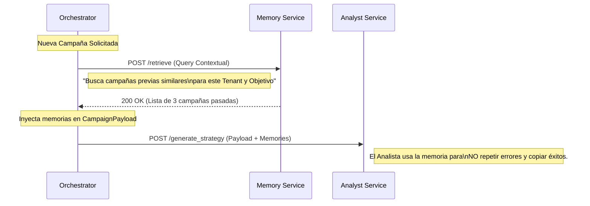
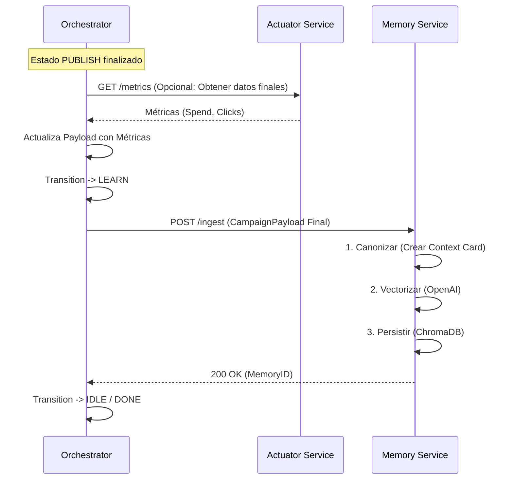

#📄 BLUEPRINT_FASE6_MEMORY.md: MEMORIA CORPORATIVA & FEEDBACK LOOP| Metadatos | Detalle |
| --- | --- |
| **Proyecto** | LeadBoostAI - Phoenix V5 |
| **Fase** | **FASE 6 - CORPORATE MEMORY (RAG)** |
| **Objetivo** | Implementar el almacenamiento de experiencias (Triadas Contexto-Acción-Resultado) y recuperación estratégica. |
| **Ubicación** | `microservice_memory/` |
| **Stack** | Python 3.11, ChromaDB (Vector), OpenAI Embeddings (`text-embedding-3-small`). |
| **Estado** | `APPROVED FOR CONSTRUCTION` |

---

##1. Visión ArquitectónicaLa memoria no es un simple log de base de datos. Es un **Motor RAG (Retrieval-Augmented Generation)** activo.
El sistema opera bajo el concepto de **Triada Normalizada**:

1. **Contexto:** ¿Qué intentábamos hacer? (Objetivo, Audiencia, Restricciones).
2. **Acción:** ¿Qué hicimos? (Estrategia, Copy, Artefactos).
3. **Resultado:** ¿Qué pasó? (KPIs, Auditoría, Errores).

El servicio `microservice_memory` es **pasivo y determinista**: solo almacena cuando se le ordena (estado `LEARN`) y solo recupera cuando se le pregunta (antes de `STRATEGY_GEN`).

---

##2. Esquema de Datos Híbrido (Memory Schema)Definimos los modelos de datos que extenderán la `shared_lib`. Estos modelos se utilizan para estructurar lo que se guarda en ChromaDB (Metadata) y lo que se vectoriza.

###2.1 Modelo de Entrada de Memoria (`MemoryEntry`)```python
# shared_lib/contracts/memory.py (Propuesto) or microservice_memory/models/schemas.py

from pydantic import BaseModel, Field
from typing import Dict, List, Optional
from uuid import UUID
from datetime import datetime
from .enums import CampaignState, QualityVerdict

class MemoryMetrics(BaseModel):
    """Resultados duros de la ejecución."""
    spend: float = 0.0
    impressions: int = 0
    clicks: int = 0
    conversions: int = 0
    ctr: float = 0.0
    roas: float = 0.0
    quality_score: int = 0 # 0-100 (Audit Score)

class ContextCard(BaseModel):
    """
    Representación CANÓNICA para vectorización.
    Este texto es lo que se convierte en embeddings.
    """
    summary_text: str # "Campaña LinkedIn para CTOs, tono formal, objetivo leads, Q3 2024..."
    tags: List[str]   # ["B2B", "High-Budget", "Video"]

class MemoryEntry(BaseModel):
    """
    La unidad atómica de memoria.
    """
    memory_id: str = Field(..., description="UUID único de la memoria")
    tenant_id: str
    execution_id: str
    campaign_id: str
    
    # Metadatos Estructurados (Filtros SQL-like)
    platform: str
    objective: str
    creation_date: datetime
    final_state: CampaignState
    quality_verdict: QualityVerdict
    
    # Data Rica (Payloads completos)
    strategy_summary: Dict # Resumen del StrategyBrief
    creative_summary: Dict # Resumen de Visual/Copy
    metrics: MemoryMetrics
    
    # Vectorización
    context_card: ContextCard
    
    class Config:
        arbitrary_types_allowed = True

```

---

##3. Motor de Vectorización (Embedding Strategy)###3.1 Stack Tecnológico* **Vector Store:** **ChromaDB**. Ejecutándose en contenedor Docker persistente.
* *Justificación:* Ya existe en la estructura del repo, es ligero, open-source y fácil de manejar localmente para desarrollo antes de escalar a pgvector/Pinecone.


* **Modelo de Embeddings:** `text-embedding-3-small` (OpenAI).
* *Justificación:* Excelente relación costo/calidad para comprensión semántica multilingüe.
* *Fallback:* `all-MiniLM-L6-v2` (SentenceTransformers) para modo offline/tests.


###3.2 Estrategia de "Chunking" (Canonicalización)**NO usaremos chunking tradicional** (dividir texto cada 500 caracteres). Eso destruye el contexto de una campaña.
Usaremos **Context Cards Generativas**:

Antes de insertar, el sistema genera un string denso y estructurado:

> "CAMPAÑA B2B. Tenant: TechCorp. Objetivo: Leads. Audiencia: Gerentes TI en Latam. Tono: Autoritario. Canal: LinkedIn Ads. Resultado: ROAS 3.5 (Alto). Calidad: PASS. Resumen: Uso de infografía técnica sobre ciberseguridad."

Este párrafo entero se convierte en un **único vector**. Esto permite búsquedas semánticas como: *"Campañas exitosas en LinkedIn para audiencias técnicas"* y el vector coincidirá por cercanía semántica.

---

##4. Arquitectura del Servicio (`microservice_memory`)###4.1 Árbol de Directorios```text
microservice_memory/
├── core/
│   ├── __init__.py
│   ├── config.py             # Configuración (Chroma Path, API Keys)
│   ├── vector_store.py       # Wrapper de ChromaDB (Singleton)
│   ├── embedding_engine.py   # Cliente OpenAI/Local
│   ├── canonizer.py          # Lógica para crear "Context Cards" desde Payloads
│   └── ingestion.py          # Orquestador de guardado (Calcula KPIs finales)
├── api/
│   ├── routes.py             # Endpoints FastAPI
│   └── dependencies.py       # Inyección de dependencias
├── models/
│   └── memory_models.py      # Pydantic Schemas internos
├── main.py                   # Entrypoint
└── requirements.txt

```

###4.2 Definición de Endpoints####`POST /ingest`Guarda una ejecución finalizada.

* **Input:** `CampaignPayload` (Estado `LEARN` o `FAILED`).
* **Lógica:**
1. Validar que el estado sea terminal.
2. Extraer métricas del Payload (si existen en `execution_logs` o un campo futuro de `metrics`).
3. `canonizer.create_card(payload)` -> Genera texto resumen.
4. `embedding_engine.embed(text)` -> Genera vector.
5. `vector_store.add(vector, metadata, id)`.


* **Output:** `{"memory_id": "...", "status": "stored"}`

####`POST /retrieve`Busca evidencia histórica para informar una nueva estrategia.

* **Input:**
```json
{
  "tenant_id": "uuid",
  "query_text": "Lanzamiento de producto SaaS B2B en Mexico",
  "filters": {
    "platform": "LINKEDIN",
    "min_quality": "PASS"
  },
  "limit": 3
}

```


* **Lógica:**
1. Generar embedding del `query_text`.
2. Ejecutar búsqueda híbrida en ChromaDB:
* `where={"tenant_id": "...", "platform": "LINKEDIN"}` (Filtro duro).
* `query_embeddings=[vector]` (Similitud semántica).


3. Retornar los Top-K resultados más cercanos.


* **Output:** Lista de `MemoryEntry` (sin el payload crudo gigante, solo resúmenes y métricas).

---

##5. Integración (The Feedback Loop)El Orquestador es quien controla cuándo se aprende y cuándo se recuerda.

###5.1 Diagrama A: Recuperación (Antes de Pensar)*Estado Orquestador: `STRATEGY_GEN` (Inicio)*



###5.2 Diagrama B: Aprendizaje (Al Finalizar)*Estado Orquestador: `LEARN*`



---

##6. Reglas de Implementación Críticas1. **Aislamiento de Tenants (Partition Key):**
* Cada consulta a ChromaDB **DEBE** incluir obligatoriamente el filtro `where={"tenant_id": request.tenant_id}`.
* **Riesgo:** Si esto falla, un cliente verá las estrategias de otro. Esto es un fallo de seguridad nivel crítico.


2. **No Alucinación en Recuperación:**
* El servicio de memoria devuelve datos crudos históricos. No intenta resumirlos ni interpretarlos. La interpretación es trabajo del `Analyst` en la siguiente fase. La memoria es "Facts only".


3. **Manejo de Fallos:**
* Si OpenAI Embeddings falla, el sistema debe reintentar (backoff).
* Si ChromaDB está caído, la operación de `/retrieve` debe fallar suavemente (retornar lista vacía) para no bloquear la creación de campañas, pero `/ingest` debe encolar el reintento para no perder datos (Data Loss).


4. **Inmutabilidad:**
* Una vez escrita una memoria (`memory_id`), su contenido semántico (lo que pasó) no cambia. Solo se pueden actualizar métricas si llegan datos tardíos (atribución retardada).


---

##Pasos Siguientes para el Ingeniero1. **Refactorizar `microservice_memory`:** Limpiar el código actual para adoptar esta estructura estricta.
2. **Implementar `Canonizer`:** Crear la lógica que convierte un JSON complejo en un string narrativo denso.
3. **Configurar Chroma:** Asegurar que `docker-compose.yml` levanta ChromaDB con persistencia de volumen.
4. **Tests:** Crear tests que simulen la ingesta de 2 campañas y verifiquen que la búsqueda por similitud devuelve la correcta.